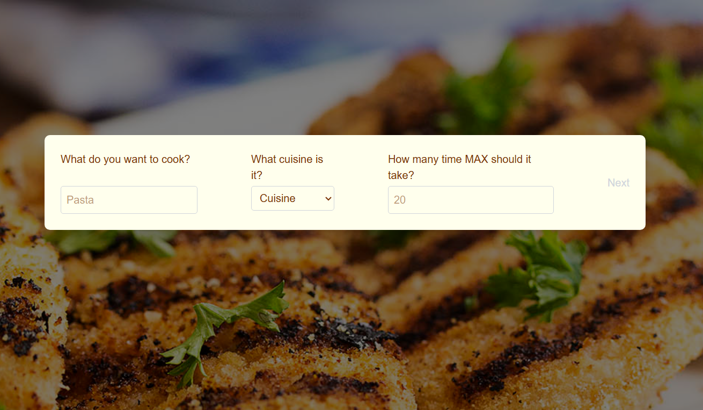
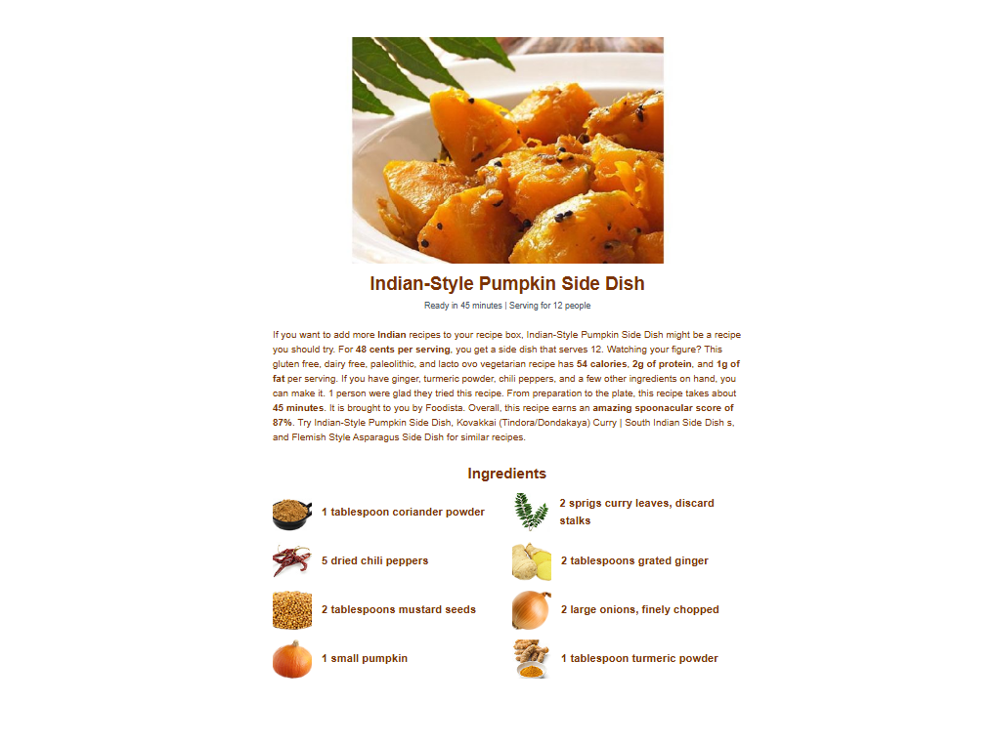

# Recipe Finder App

Web application for finding and viewing recipes based on keywords, cuisine and preparation time.

# Overview

The app is a moder webapp for finding what to cook quickly and comfortably. It has adaptive and responsive design, user-friendly colors and useful functionality.

## Tech Stack

React, Next.js, Tailwind

## Installation

### Prerequisites

- Node.js
- React

### Setup

Clone git repository

```bash
  git clone https://link-to-the-app
```

Install dependencies with npm

```bash
  npm install
```

## Usage

After deploying, site will be accessed via website link.

Here are some screenshots:

Main Page


Recipes Page


Recipe Info Page(minimized)


## Contributing

Contributions are welcome! Please open an issue or pull request.

Fork the repo

Create your branch (git checkout -b feat/feature-name)

Commit your changes

Push to the branch

Open a pull request

## License

[MIT](https://choosealicense.com/licenses/mit/)
